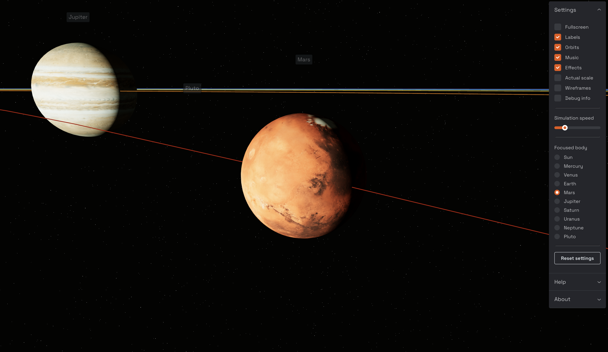

# Model Solar System

A model Solar System built with [Three.js](https://threejs.org/), [React](https://reactjs.org/) and [React Three Fiber](https://docs.pmnd.rs/react-three-fiber/getting-started/introduction).

[Click here for an interactive demo!](https://model-solar-system.vercel.app/)



## Run the app locally

```bash
npm install
npm run dev
```

Then go to <http://localhost:3000>.

## To do list

- fix body labels not sitting above body when actual scale is enabled
- fix camera / logarithmic buffer (not currently working) <https://threejs.org/examples/#webgl_camera_logarithmicdepthbuffer>
- add lens flare: <https://threejs.org/examples/#webgl_lensflares>
- experiment with orbit line rendering and add opacity: <https://threejs.org/examples/#webgl_lines_fat>
- selective bloom for bodies: <https://threejs.org/examples/#webgl_postprocessing_unreal_bloom_selective>
- recursive body type and rendering (to allow support for moons and satellites)
- add ring geometry for body ring such as for Saturn
- add adaptive DPR (performance scaling): <https://github.com/pmndrs/drei#adaptivedpr>
